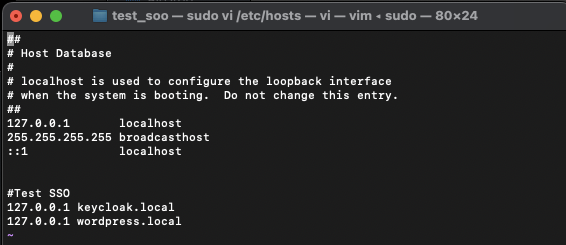
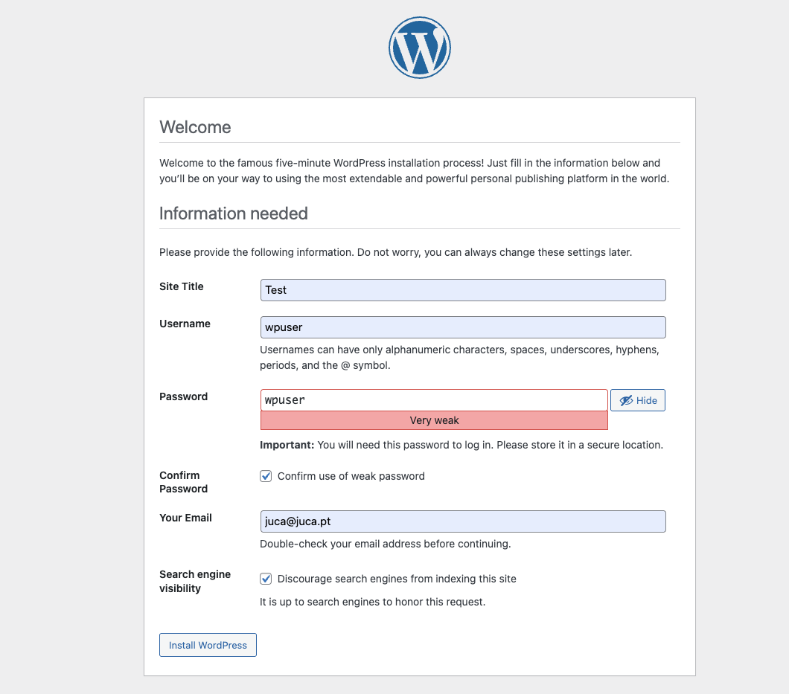
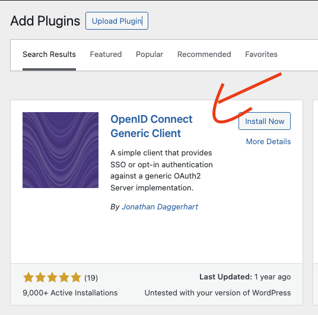
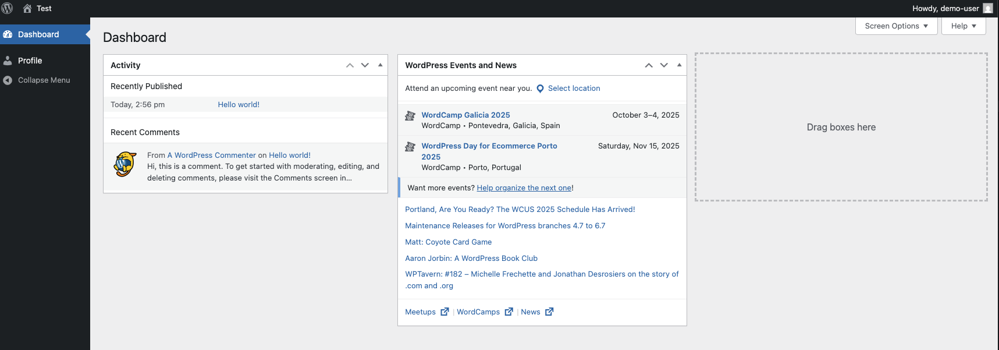

# WordPress-Keycloak SSO Demo

This repository demonstrates Single Sign-On (SSO) integration between WordPress and Keycloak using Docker. The setup includes:

- Keycloak as the identity provider
- WordPress with OpenID Connect plugin
- PostgreSQL for Keycloak
- MySQL for WordPress
- Nginx as a proxy for Keycloak

## Prerequisites

- Docker and Docker Compose
- Local DNS configuration
- Git

## Quick Start

### 1. Clone the Repository

```bash
git clone https://github.com/yourusername/wordpress-keycloak-sso.git
cd wordpress-keycloak-sso
```

### 2. Configure Hosts File

Add the following entries to your `/etc/hosts` file:

```
127.0.0.1 keycloak.local
127.0.0.1 wordpress.local
```

Example:


### 3. Start the Services

```bash
docker-compose up -d
```

This command starts all containers in detached mode. The first startup may take a few minutes.

### 4. Verify Services

- Keycloak: http://keycloak.local:8080/admin
- WordPress: http://wordpress.local:8081/wp-login.php

## Access Credentials

### Keycloak

- **Admin Console**: http://keycloak.local:8080/admin
  - Username: `admin`
  - Password: `admin`
- **Demo User** (for SSO testing):
  - Realm: `demo`
  - Username: `demo-user`
  - Password: `Password1!`

### WordPress

- **Admin Console**: http://wordpress.local:8081/wp-login.php
  - Username: `wpuser`
  - Password: `wpuser`



## WordPress OpenID Connect Configuration

Search for and install the plugin:

- Plugin name: OpenID Connect Generic Client
- Author: Jonathan Daggerhart
- Version: 3.10.0+



### Plugin Configuration

Configure the OpenID Connect Generic Client plugin with these settings:

```
Client ID: wordpress-client
Client Secret Key: wordpress-secret
OpenID Scope: openid email profile
Login Endpoint URL: http://keycloak.local:8080/realms/demo/protocol/openid-connect/auth
Userinfo Endpoint URL: http://keycloak:8080/realms/demo/protocol/openid-connect/userinfo
Token Validation Endpoint URL: http://keycloak:8080/realms/demo/protocol/openid-connect/token
End Session Endpoint URL: http://keycloak.local:8080/realms/demo/protocol/openid-connect/logout
Link Existing Users: checked
```

Keep other settings as default.

## Testing SSO Integration

1. Open an incognito browser window
2. Navigate to http://wordpress.local:8081/wp-login.php
3. Click on "Login with OpenID Connect"
4. Enter Keycloak credentials when prompted:
   ```
   Username: demo-user
   Password: Password1!
   ```
5. You should be redirected to the WordPress dashboard



## Stopping the Services

To stop all containers while preserving data:

```bash
docker-compose down
```

To stop and remove all data (containers, networks, volumes):

```bash
docker-compose down -v
```

## Troubleshooting

- If Keycloak fails to start, check PostgreSQL container logs:

  ```bash
  docker-compose logs keycloak-db
  ```

- For WordPress issues, check WordPress and MySQL logs:

  ```bash
  docker-compose logs wordpress
  docker-compose logs wp-db
  ```

- Ensure the hosts file entries are correct and your browser isn't caching old redirects

## Architecture

This setup uses Docker Compose to orchestrate multiple containers:

- `keycloak-db`: PostgreSQL database for Keycloak
- `keycloak`: Keycloak identity server
- `nginx`: Proxy for Keycloak
- `wp-db`: MySQL database for WordPress
- `wordpress`: WordPress application server

All services use a shared Docker network `sso-net` for communication.

---
